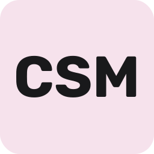

### Check out some projects I’ve built

<table>
  <tr>
    <td width="120">
      
    </td>
    <td>
      <strong><a href="https://github.com/sivert-io/matchzy-auto-tournament">MAT — MatchZy Auto Tournament</a></strong> 
      🏆 Complete CS2 tournament automation — extensible brackets, real-time match tracking, auto server allocation.
    </td>
  </tr>

  <tr><td colspan="2" height="14"></td></tr>

  <tr>
    <td width="120">
      
    </td>
    <td>
      <strong><a href="https://gryt.chat">Gryt</a></strong> 
      Open-source voice & text chat platform — my biggest passion project.
    </td>
  </tr>

  <tr><td colspan="2" height="14"></td></tr>

  <tr>
    <td width="120">
      
    </td>
    <td>
      <strong><a href="https://github.com/sivert-io/cs2-server-manager">CSM — Counter-Strike Server Manager</a></strong> 
      💣 Automated CS2 multi-server manager with competitive plugins and tournament integration.
    </td>
  </tr>
</table>

 

## 👋🏼 Hey, I'm **Sivert**

I'm a Norwegian developer, designer, and lifelong tinkerer who loves building things people don’t quite believe will work… until they do.

- 🛠️ **Building:** [**Gryt**](https://github.com/Gryt-chat) — an open-source voice & text chat platform  
- 🎮 **Automating:** [**MatchZy Auto Tournament (MAT)**](https://github.com/sivert-io/matchzy-auto-tournament) — a CS2 tournament tool used at NTLAN  
- 🎓 **Studying:** Master’s in Interaction Design at NTNU (our bachelor project won the 🏆 Eurekaprize 2023)  
- 🌱 **Passionate about:** sustainable web, accessibility, and well-crafted digital experiences  
- 🎧 **Fun fact:** I’ve been producing music since I was 12  
- 🚗 **Side quests:** photography, gaming, and modding my Golf GTI Edition 35 — see [edition35.com](https://edition35.com)  

---

## 🧠 Tech & Tools I Enjoy  
JavaScript / TypeScript • Node.js • React • TailwindCSS • C# • Godot • AI/ML • Open Source • Accessibility • Sustainable Web

---

## 🏆 Badges & Counters  
  

