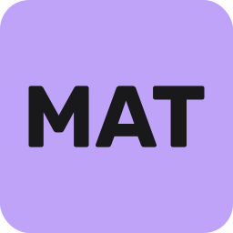
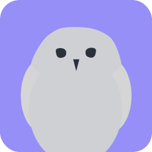

  <!-- Project Icons -->
  
  &nbsp;&nbsp;&nbsp;&nbsp;
  

 

## 👋🏼 Hey, I'm **Sivert**

I'm a Norwegian developer, designer, and lifelong tinkerer who loves building things people don’t quite believe will work… until they do.

- 🛠️ **Building:** [**Gryt**](https://github.com/Gryt-chat) — an open-source voice & text chat platform  
- 🎮 **Automating:** [**MatchZy Auto Tournament (MAT)**](https://github.com/sivert-io/matchzy-auto-tournament) — a CS tournament tool used at NTLAN  
- 🎓 **Studying:** Master’s in Interaction Design at NTNU (our bachelor project won the 🏆 Eurekaprize 2023)  
- 🌱 **Passionate about:** sustainable web, accessibility, and well-crafted digital experiences  
- 🎧 **Fun fact:** I’ve been producing music since I was 12  
- 🚗 **Side quests:** photography, gaming, and modding my Golf GTI Edition 35 — see [edition35.com](https://edition35.com)  

---

## 🧠 Tech & Tools I Enjoy  
JavaScript / TypeScript • Node.js • React • TailwindCSS • C# • Godot • AI/ML • Open Source • Accessibility • Sustainable Web

---

## 🏆 Badges & Counters  
  

