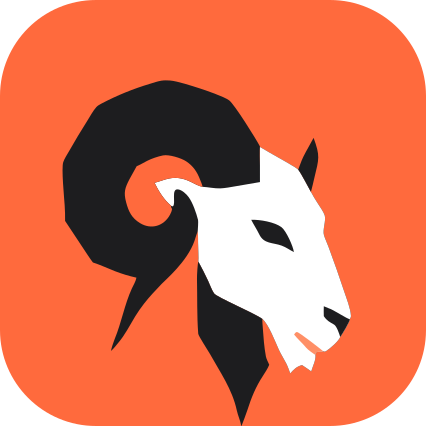
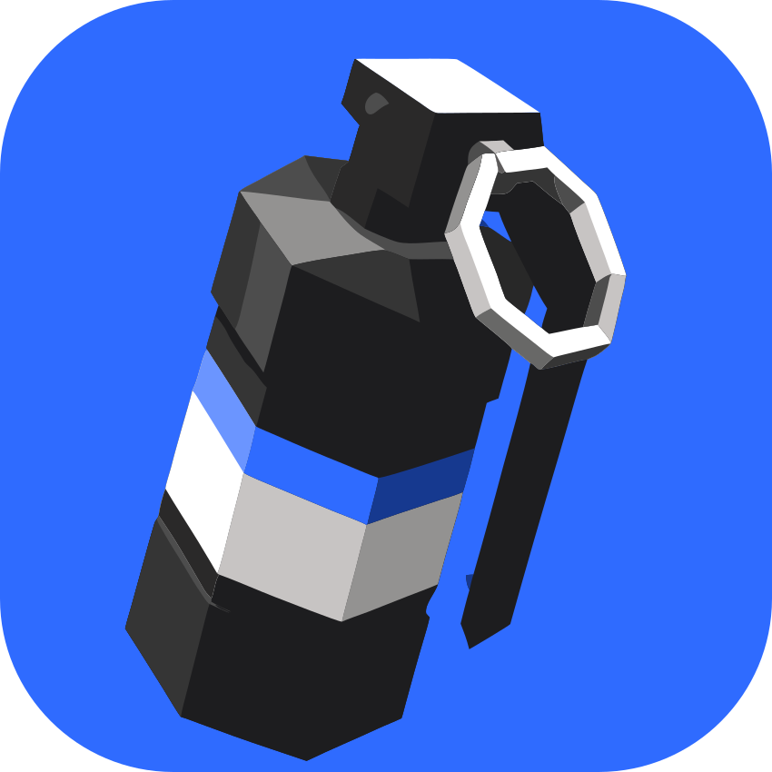

### Some things I've built

<table>
  <tr>
    <td width="120">
      
    </td>
    <td>
      <strong><a href="https://gryt.chat">Gryt</a></strong> 
      🦉 Self-hosted voice, text and video chat over WebRTC. Desktop and web clients, a Go SFU, and a server you run yourself. Four years in and still my main project.
    </td>
  </tr>

  <tr><td colspan="2" height="14"></td></tr>

  <tr>
    <td width="120">
      
    </td>
    <td>
      <strong><a href="https://github.com/Auto-Tournament/auto-tournament">Auto Tournament</a></strong> 
      🏆 Self-hosted tournament platform (formerly MatchZy Auto Tournament) that runs CS2 tournaments on servers with the Auto Tournament CS2 plugin: brackets, map veto, match loading and live scores. Used at NTLAN.
    </td>
  </tr>

  <tr><td colspan="2" height="14"></td></tr>

  <tr>
    <td width="120">
      
    </td>
    <td>
      <strong><a href="https://github.com/Auto-Tournament/cs2-plugin">Auto Tournament CS2</a></strong> 
      ⚡ CS2 server plugin for Auto Tournament (formerly MatchZy Enhanced), based on MatchZy: extra events, a match report API and per-server config.
    </td>
  </tr>

  <tr><td colspan="2" height="14"></td></tr>

  <tr>
    <td width="120">
      
    </td>
    <td>
      <strong><a href="https://github.com/Auto-Tournament/cs2-server-manager">CSM — CS2 Server Manager</a></strong> 
      💣 Command-line tool that installs and runs several CS2 dedicated servers on one Linux machine, with the Auto Tournament CS2 plugin, CounterStrikeSharp and Metamod.
    </td>
  </tr>

  <tr><td colspan="2" height="14"></td></tr>

  <tr>
    <td width="120">
      
    </td>
    <td>
      <strong><a href="https://github.com/sivert-io/sprakvask">Språkvask</a></strong> 
      🇳🇴 A Norwegian language skill for AI coding agents. Encodes Språkrådet's norms for spelling, punctuation and plain language — and catches the tells of Norwegian written by someone thinking in English.
    </td>
  </tr>

  <tr><td colspan="2" height="14"></td></tr>

  <tr>
    <td width="120">
      
    </td>
    <td>
      <strong><a href="https://github.com/sivert-io/kanbn-github-sync">KGS — Kanbn GitHub Sync</a></strong> 
      🔄 Pulls GitHub issues onto a Kanbn board and works out which list each one belongs on, so there is no board to set up by hand.
    </td>
  </tr>
</table>

 

## 👋🏼 Hey, I'm **Sivert**

Norwegian developer and designer with a huge passion for free and open-source software. I started coding exactly <!--coding-->13 years, 6 months and 20 days<!--/coding--> ago, and I like building things that solve real problems — mostly tournament automation and chat platforms.

- 🛠️ Building [**Gryt**](https://github.com/Gryt-chat), an open-source voice & text chat platform  
- 💼 Senior Product Engineer & UX Designer at [**Frifor**](https://frifor.app), after four years on gaming platforms at Norsk Tipping  
- 🎮 Maintaining [**Auto Tournament**](https://github.com/Auto-Tournament/auto-tournament), a CS2 tournament tool used at NTLAN  
- 🎓 Master's in Interaction Design at NTNU, grade A. Our bachelor project won the 🏆 Eurekaprize 2023  
- 📄 Two peer-reviewed papers on sustainable web design: [HCI International](https://doi.org/10.1007/978-3-031-35699-5_11) and [ACM MuC](https://dl.acm.org/doi/abs/10.1145/3603555.3608529)  
- 🌱 Into FOSS, sustainable web, and accessibility  
- 🎧 I've been producing music since I was 12  
- 🚗 Side quests: photography, gaming, and modding my Golf GTI Edition 35 — see [edition35.com](https://edition35.com)  

---

## 🧠 Tech & tools I enjoy  
JavaScript / TypeScript • React & React Native • Next.js • Node.js • Go • TailwindCSS • C# • Godot • Docker • AI/ML • Accessibility • Sustainable Web

---

## 🏆 Badges & counters  
  

